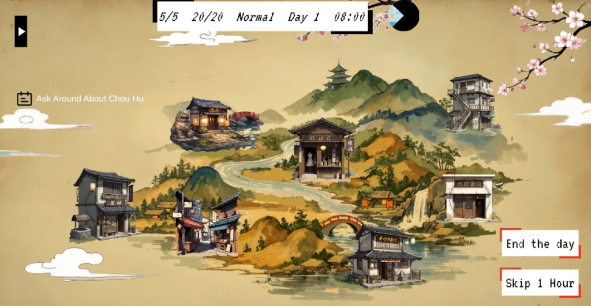
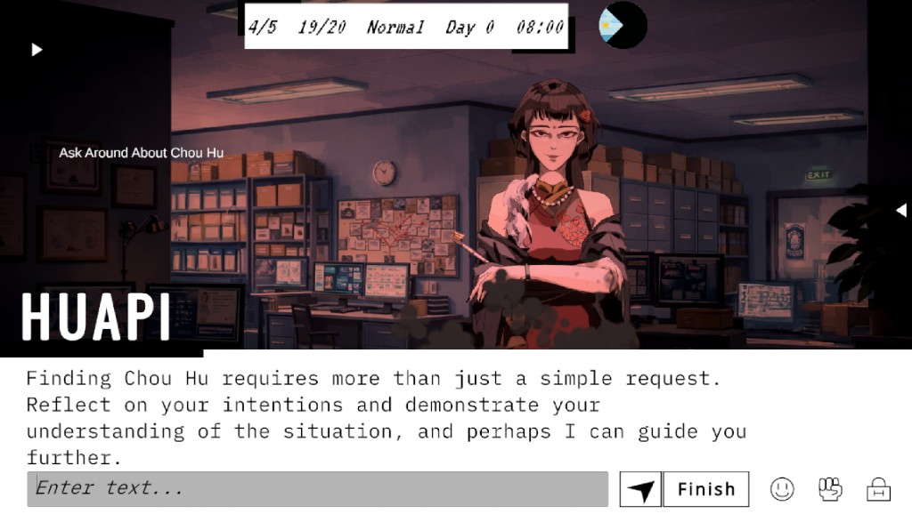
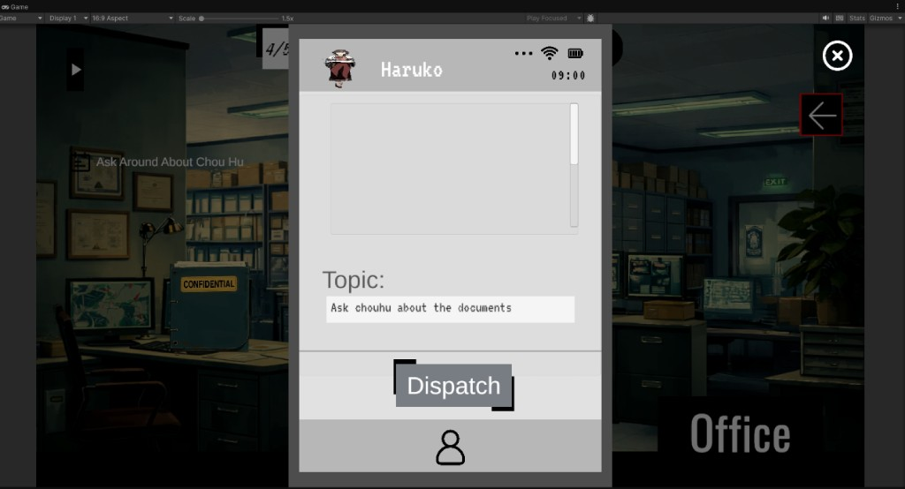
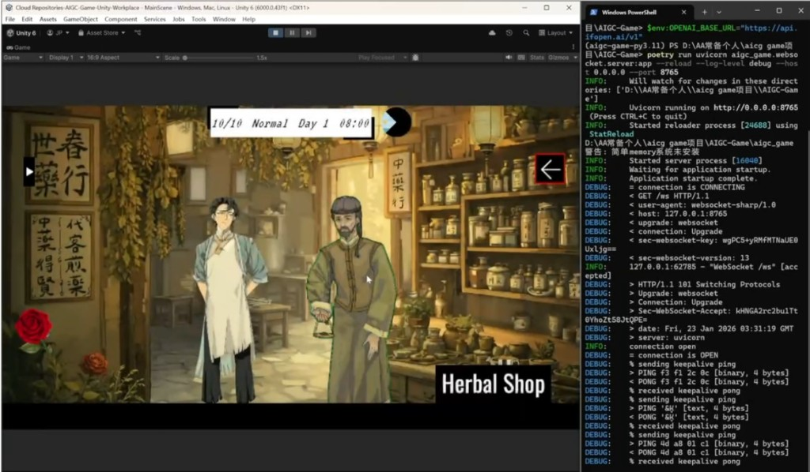

# AIGC Game Demo - 智能 NPC 互动系统

这是一个基于大语言模型（LLM）驱动的智能 NPC 互动系统演示项目。它利用 LangGraph 和 LangChain 构建了一个动态的、具有情感感知和场景理解能力的对话环境。

## 🌟 核心特性

- **多 NPC 动态对话**：支持多个 NPC 之间以及玩家与 NPC 之间的自然语言交互。
- **情感感知系统**：NPC 能够分析对话情感，并根据情感状态调整回复策略和行为。
- **场景控制与 WorldState**：引入 WorldState 结算机制，自动分析对话内容是否达成场景目标（任务），并更新世界状态。
- **任务驱动叙事**：每个场景可配置特定任务，系统通过 CoT（思维链）技术自动判定任务完成情况。
- **灵活的运行模式**：支持玩家参与模式（Player Involved）和 NPC 纯对话模式（NPC Only）。
- **可观测性**：集成 LangSmith，提供完整的对话链路追踪和 Prompt 调试能力。

## 📊 系统工作流 (Workflow)

<p align="center">
  
</p>

该工作流展示了从玩家输入到 NPC 认知层处理，再到 WorldState 结算和记忆构建的完整闭环。

## 🖼️ 游戏界面展示 (Unity Frontend Screenshots)

### 🗺️ 场景地图与探索
<p align="center">
  
</p>

### 💬 NPC 对话交互
<p align="center">
  
</p>

### 📱 任务调度系统
<p align="center">
  
</p>

### 🎮 Unity 集成演示
<p align="center">
  
</p>

## 🚀 快速开始

### 1. 环境准备

- **Python**: 3.10 或 3.11 (推荐使用 Anaconda 管理环境)
- **API Key**: 需要 OpenAI API Key（或其他兼容的 LLM 服务）

### 2. 安装步骤

```bash
# 克隆项目
git clone <repository-url>
cd aigc_game

# 创建并激活环境
conda create -n aigc_game python=3.10 -y
conda activate aigc_game

# 安装依赖
pip install -r requirements.txt
```

### 3. 配置环境变量

在项目根目录创建 `.env` 文件，并配置以下内容：

```env
# LLM 配置
OPENAI_API_KEY=your_openai_api_key
OPENAI_BASE_URL=https://api.openai.com/v1  # 或你的代理地址

# LangSmith 监控 (可选，推荐)
LANGCHAIN_TRACING_V2=true
LANGCHAIN_ENDPOINT=https://api.smith.langchain.com
LANGCHAIN_API_KEY=your_langsmith_api_key
LANGCHAIN_PROJECT=aigc_game_demo
```

## 🎮 运行演示 (核心入口)

项目的主要测试和运行入口是 `run_chat.py`。它提供了一个交互式的命令行界面，让你选择场景并开始体验。

```bash
python run_chat.py
```

**操作说明：**
- **选择场景**：启动后输入数字选择 `data/scene_data/demo.json` 中定义的场景。
- **对话交互**：在场景中，你可以选择目标 NPC 并输入你的对话内容。
- **退出场景**：输入 `exit` 退出当前场景。退出时，系统会自动触发 **WorldState 结算**，展示任务完成情况和场景总结。
- **退出程序**：在场景选择界面输入 `q` 退出。

## 📁 项目结构

- `run_chat.py`: **核心运行入口**，负责场景加载、环境初始化和主循环。
- `main/`: 包含 `chat_runner.py`，封装了对话运行逻辑和 WorldState 结算流程。
- `npc/`: 系统的核心逻辑。
    - `multi_npc/`: 多 NPC 环境管理、工作流调度（LangGraph 实现）。
    - `single_npc/`: 单个 NPC 的节点逻辑、Prompt 模板和工具集。
    - `worldstate/`: 世界状态生成、匹配和结算逻辑。
    - `knowledge/`: NPC 记忆与知识库管理。
- `data/`: 存放场景配置 (`scene_data/`)、NPC 信息 (`npc_info/`) 和 Prompt 模板。
- `tests/`: 包含各种功能模块的集成测试脚本。

## 🛠️ 技术栈

- **框架**: [LangGraph](https://github.com/langchain-ai/langgraph), [LangChain](https://github.com/langchain-ai/langchain)
- **模型**: OpenAI GPT 系列 (支持自定义 Base URL)
- **数据校验**: Pydantic
- **追踪**: LangSmith

## 📝 开发备注

- 场景数据定义在 `data/scene_data/demo.json` 中，你可以通过修改该文件来增加新的故事情节或任务目标。
- NPC 的性格和背景设定位于 `data/npc_info/`。
- 核心对话逻辑流转位于 `npc/multi_npc/chat_env.py`。


