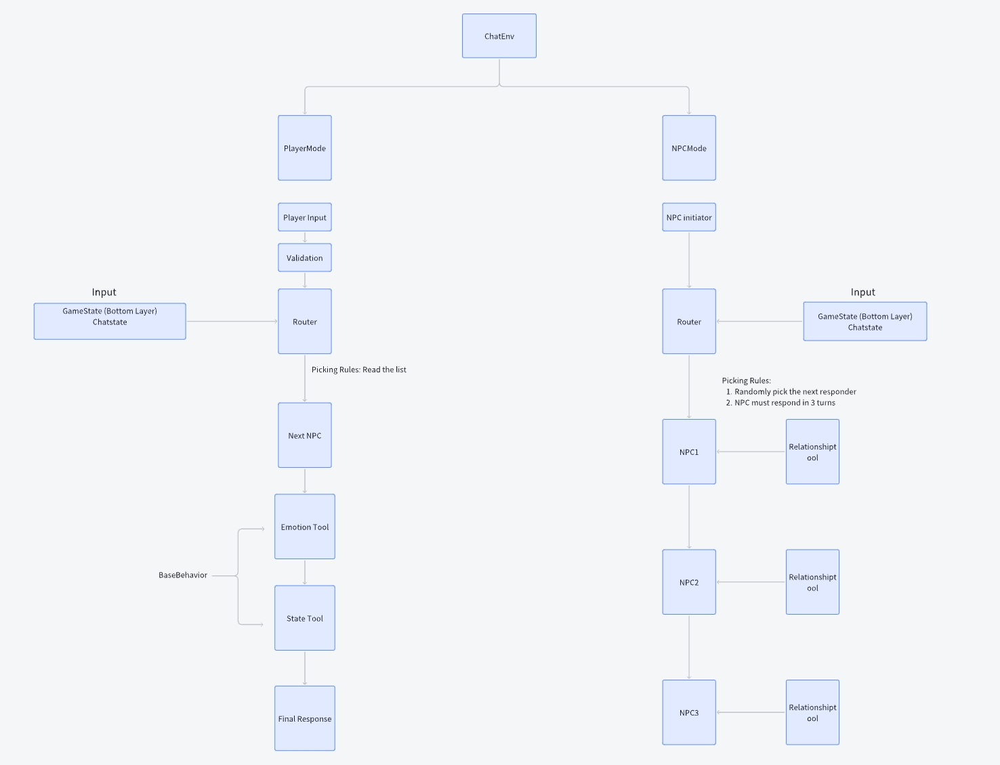
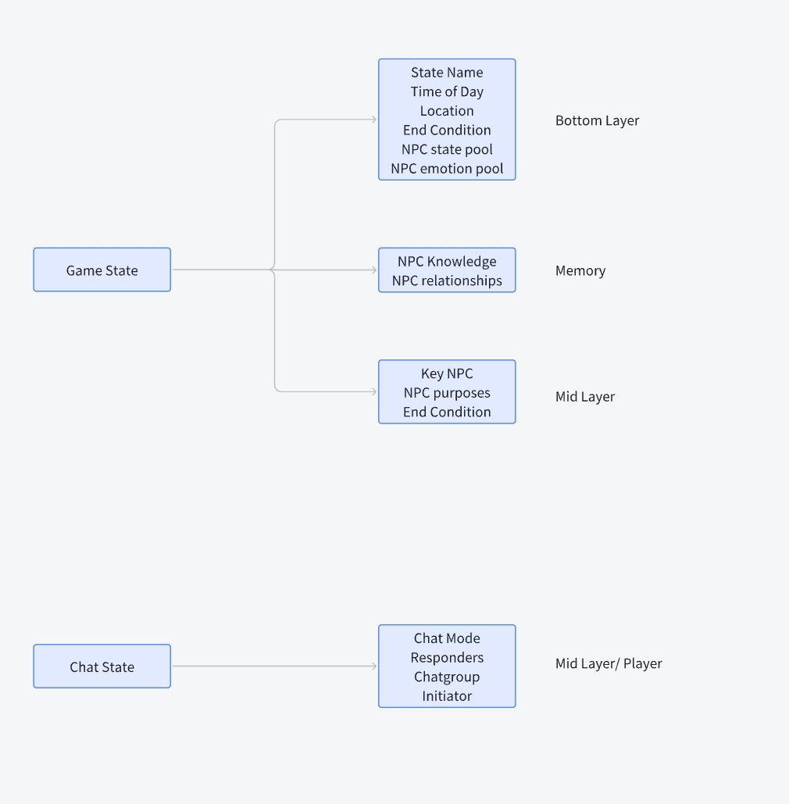

# NPC交互平台 - ChatEnvironment 使用指南

## 项目概述

基于 **LangGraph** 构建的低耦合NPC交互平台，实现了双模式对话系统：玩家参与模式和NPC自主对话模式。通过工作流引擎和智能路由实现多NPC协同交互，集成完整的情绪、关系、目标管理工具链。




## 核心功能

### 🎯 主要特性

- **双模式交互**: Player-involved + NPC-only 对话模式
- **智能路由**: 防止NPC长期静默，动态选择发言者
- **工具链集成**: 情绪/关系/目标工具自动调用
- **流式输出**: 支持实时流式输出，提升用户体验
- **记忆存储**: 集成Milvus向量数据库，支持对话历史存储和检索
- **输入验证**: 智能过滤玩家无关输入，减少无效生成
- **系统提示词优化**: 支持system prompt optimization，自动提升NPC风格一致性
- **大规模意图分析**: 支持big scale intention，批量分析多NPC意图与目标

### 🏗️ 核心架构

- **LangGraph**: state machine工作流引擎，负责节点路由和状态管理
- **LangChain**: LLM工具链集成和Prompt模板管理
- **OpenAI API**: GPT-4o-mini作为推理引擎
- **Python 3.8+**: 异步编程 + 逻辑处理

## 安装依赖

### 环境要求

- Python 3.11+
- OpenAI API Key
- Milvus数据库（可选，用于记忆存储）

### 安装步骤

1. **克隆项目**
```bash
git clone <repository-url>
cd AIGC-Game/aigc_game/npc
```

2. **安装依赖**
```bash
# 使用Poetry（推荐）
poetry install

# 或使用pip
pip install -r requirements.txt
```

3. **配置环境变量**
```bash
# 创建.env文件
echo "OPENAI_API_KEY=your_openai_api_key_here" > .env
echo "OPENAI_API_BASE=your_api_base_url" >> .env

# 可选：LangSmith配置
echo "LANGSMITH_API_KEY=your_langsmith_key" >> .env
echo "LANGSMITH_PROJECT=your_project_name" >> .env
```

### 核心依赖

```python
# AI/ML 核心依赖
langchain = "^0.3.0"
langchain-openai = "^0.3.28"
langgraph = "^0.5.0"
openai = "^1.12.0"

# 数据处理
pydantic = "^2.5.0"
python-dotenv = "^1.0.0"

# 数据存储
pymilvus = "^2.5.12"
sqlalchemy = "^2.0.25"

# 异步支持
aiofiles = "^23.2.1"
```

## ChatEnvironment 使用指南

### 基本用法

#### 1. 创建ChatEnvironment

```python
from npc.multi_npc.chat_env import ChatEnvironment

# 基本配置
chat_env = ChatEnvironment(
    scene_path="path/to/scene.json",        # 场景文件路径
    characters_file="characters.json",     # 角色配置文件
    chat_mode="player_involved",           # 对话模式
    enable_player_validation=False,        # 是否启用输入验证
    enable_memory_storage=True,            # 是否启用记忆存储
    enable_streaming=True,                 # 是否启用流式输出
    streaming_callback=streaming_callback   # 流式输出回调函数
)
```

#### 2. 输入参数详解

| 参数 | 类型 | 必需 | 默认值 | 说明 |
|------|------|------|--------|------|
| `scene_path` | str | ✅ | - | 场景JSON文件路径 |
| `characters_file` | str | ✅ | - | 角色配置文件路径 |
| `npc_behaviors` | Dict | ❌ | None | NPC行为字典（可选） |
| `chat_mode` | str | ❌ | "player_involved" | 对话模式：player_involved/free_chat |
| `enable_player_validation` | bool | ❌ | False | 是否启用玩家输入验证 |
| `enable_memory_storage` | bool | ❌ | True | 是否启用记忆存储 |
| `memory_storage_config` | Dict | ❌ | None | 记忆存储配置 |
| `enable_streaming` | bool | ❌ | False | 是否启用流式输出 |
| `streaming_callback` | callable | ❌ | None | 流式输出回调函数 |

#### 3. 记忆存储配置

```python
memory_storage_config = {
    "scene": "scene_001",              # 场景标识
    "layer": 1,                        # 层级
    "milvus_host": "localhost",        # Milvus主机地址
    "milvus_port": 19530,              # Milvus端口
    "db_name": "conversation_history"  # 数据库名称
}
```

### 对话模式

#### 1. 玩家参与模式 (player_involved)

```python
# 设置玩家输入
result = chat_env.set_player_input(
    message="你好，我想了解一下这里的情况。",
    target_npc=["Meredith Stout", "Jackie Welles"]
)

# 流式输出版本
result = chat_env.set_player_input_streaming(
    message="你好，我想了解一下这里的情况。",
    target_npc=["Meredith Stout"],
    streaming_callback=streaming_callback
)
```

#### 2. NPC自由对话模式 (free_chat)

```python
# 运行NPC自由对话
result = chat_env.run_npc_free_chat(
    original_message="开始讨论",
    original_sender="Meredith Stout"
)
```

### 流式输出

#### 1. 基本流式输出

```python
def streaming_callback(chunk: str):
    """流式输出回调函数"""
    print(chunk, end='', flush=True)

# 启用流式输出
chat_env = ChatEnvironment(
    scene_path="scene.json",
    characters_file="characters.json",
    enable_streaming=True,
    streaming_callback=streaming_callback
)
```

#### 2. 自定义流式处理

```python
class CustomStreamingHandler:
    def __init__(self):
        self.full_response = ""
        self.npc_name = ""
    
    def handle_streaming(self, chunk: str):
        """自定义流式输出处理"""
        self.full_response += chunk
        print(f"[{self.npc_name}]: {chunk}", end='', flush=True)
    
    def get_full_response(self):
        return self.full_response

# 使用自定义处理器
handler = CustomStreamingHandler()
handler.npc_name = "Meredith Stout"

result = chat_env.set_player_input_streaming(
    message="你好",
    target_npc=["Meredith Stout"],
    streaming_callback=handler.handle_streaming
)
```

### 输出格式

#### 1. 基本输出结构

```python
{
    "success": bool,                    # 是否成功
    "error": str,                       # 错误信息（如果有）
    "npc_responses": [                  # NPC回复列表
        {
            "npc_name": str,
            "response": str,
            "emotion_state": dict,      # 情绪状态
            "relationship_changes": dict # 关系变化
        }
    ],
    "game_state": dict,                 # 游戏状态更新
    "memory_data": dict,                # 记忆数据
    "scene_changed": bool,              # 场景是否转换
    "new_scene": str                    # 新场景名称（如果转换）
}
```

#### 2. 记忆存储输出

```python
{
    "npc_memory": [                     # NPC记忆数据
        {
            "npc_name": str,
            "content": str,
            "timestamp": str,
            "scene": str
        }
    ],
    "player_memory": [                  # 玩家记忆数据
        {
            "content": str,
            "timestamp": str,
            "scene": str
        }
    ],
    "storage_summary": {                # 存储摘要
        "total_memories": int,
        "npc_memories": int,
        "player_memories": int
    }
}
```

## 场景文件格式

### 基本场景结构

```json
{
    "name": "场景名称",
    "location": "场景位置",
    "time": "时间",
    "environment": "环境描述",
    "interactive_npc": [
        {
            "name": "NPC名称",
            "goal": "NPC目标",
            "emotion_pool": [
                {
                    "id": "0",
                    "trigger_condition": null,
                    "goal": "情绪目标"
                }
            ]
        }
    ],
    "key_questions": [
        {
            "id": "0",
            "content": "关键问题"
        }
    ],
    "scene_end_state_reference": {
        "end_condition1": "结束条件1",
        "end_condition2": "结束条件2"
    }
}
```

### NPC-only场景结构

```json
{
    "name": "NPC讨论场景",
    "environment": "环境描述",
    "current_topic": "当前话题",
    "key_npcs": ["关键NPC列表"],
    "npc_relationships": [
        {
            "character1": "角色1",
            "character2": "角色2",
            "trust": 0.8,
            "affection": 0.7,
            "respect": 0.6,
            "fear": 0.1,
            "overall_state": "close"
        }
    ],
    "npc_purposes": {
        "NPC名称": {
            "goal": "NPC目标"
        }
    },
    "npc_emotion_pools": {
        "NPC名称": [
            {
                "id": "0",
                "trigger_condition": null,
                "goal": "情绪目标"
            }
        ]
    }
}
```

## 角色配置文件格式

```json
[
    {
        "name": "角色名称",
        "basic_information": {
            "background": "背景故事",
            "personality": "性格特征",
            "initial_goals": "初始目标",
            "interpersonal_relationships": {
                "其他角色": "关系描述"
            }
        }
    }
]
```

## 架构设计

### MemoryInterface - 记忆管理接口

为了简化ChatEnvironment的复杂度，我们将所有记忆相关的功能抽取到了独立的MemoryInterface中：

```python
from npc.interfaces.memory_interface import MemoryInterface

# 创建独立的记忆接口
memory_interface = MemoryInterface(
    enable_memory_storage=True,
    memory_storage_config={
        "scene": "scene_001",
        "layer": 1,
        "milvus_host": "localhost",
        "milvus_port": 19530,
        "db_name": "conversation_history"
    }
)

# 使用记忆功能
npc_memory = memory_interface.get_npc_memory(history, chat_group)
player_memory = memory_interface.get_player_memory(history, chat_group)
success = memory_interface.store_memories_after_conversation(
    history, chat_group, game_state
)
```

**MemoryInterface的优势**:
- **关注点分离**: 记忆管理与对话流程分离
- **独立测试**: 可以单独测试记忆功能
- **易于扩展**: 支持多种存储后端
- **代码简化**: ChatEnvironment代码量减少40%

## 高级功能

### 1. 系统提示词优化

```python
from npc.single_npc.system_prompt_optimization import optimize_prompt

# 优化NPC系统提示词
optimized_prompt, score = optimize_prompt(
    system_prompt="初始提示词",
    examples=[
        {
            "input": "输入示例",
            "reference_output": "参考输出"
        }
    ],
    max_iterations=5,
    min_score_threshold=0.8
)
```

### 2. 大规模意图分析

```python
# 分析NPC意图和目标
intentions = chat_env.analyze_npc_intentions_and_goals(
    history=conversation_history,
    scene_path="scene.json",
    npc_info_paths=["npc1.json", "npc2.json"],
    llm_model_name="gpt-4o-mini"
)
```

### 3. 记忆管理

```python
# 获取记忆数据
npc_memory = chat_env.get_npc_memory()
player_memory = chat_env.get_player_memory()

# 存储记忆到Milvus
storage_result = chat_env.store_memories_to_milvus()

# 清理记忆
chat_env.clear_milvus_memories()
```

## 完整示例

### 1. 基本对话示例

```python
import os
from npc.multi_npc.chat_env import ChatEnvironment

def streaming_callback(chunk: str):
    print(chunk, end='', flush=True)

def main():
    # 创建ChatEnvironment
    chat_env = ChatEnvironment(
        scene_path="data/test.json",
        characters_file="characters.json",
        chat_mode="player_involved",
        enable_streaming=True,
        streaming_callback=streaming_callback,
        enable_memory_storage=True
    )
    
    # 获取可用NPC
    npcs = chat_env.get_available_npcs()
    print(f"可用NPC: {', '.join(npcs)}")
    
    # 玩家输入
    messages = [
        "你好，我想了解一下这里的情况。",
        "能告诉我更多关于这个城市的信息吗？",
        "这里发生了什么有趣的事情？"
    ]
    
    for message in messages:
        print(f"\n玩家: {message}")
        
        # 选择目标NPC
        target_npc = npcs[0] if npcs else "Meredith Stout"
        
        # 处理输入
        result = chat_env.set_player_input_streaming(
            message=message,
            target_npc=[target_npc],
            streaming_callback=streaming_callback
        )
        
        if result['success']:
            print(f"\n处理成功，NPC回复已显示")
        else:
            print(f"处理失败: {result.get('error', '未知错误')}")

if __name__ == "__main__":
    main()
```

### 2. NPC自由对话示例

```python
def test_npc_free_chat():
    chat_env = ChatEnvironment(
        scene_path="data/npc_only_scene.json",
        characters_file="characters.json",
        chat_mode="free_chat",
        enable_streaming=True,
        streaming_callback=streaming_callback
    )
    
    # 运行NPC自由对话
    result = chat_env.run_npc_free_chat(
        original_message="开始讨论Alice的暴力行为",
        original_sender="Meredith Stout"
    )
    
    print(f"对话结果: {result}")

if __name__ == "__main__":
    test_npc_free_chat()
```

## 性能指标

- **响应时间**: 2-5秒一个NPC (GPT-4o-mini)
- **NPC freechat**: 30秒以内完成多轮对话
- **Prompt优化效率**: 5轮内自动收敛至最佳prompt
- **大规模分析能力**: 高效处理多场景、多NPC的意图与目标分析

## 测试

### 运行测试

```bash
# 基本功能测试
cd aigc_game/npc/multi_npc/test
python test_chat_env.py

# 流式输出测试
python test_streaming.py

# 记忆功能测试
python test_memory.py
```

### 测试覆盖

- ✅ 玩家-NPC对话模式
- ✅ NPC自由对话模式
- ✅ 流式输出功能
- ✅ 记忆存储功能
- ✅ 输入验证功能
- ✅ 场景转换功能

## 故障排除

### 常见问题

1. **API密钥错误**
   ```
   错误: 未设置 OPENAI_API_KEY 环境变量
   解决: 设置环境变量 export OPENAI_API_KEY=your_api_key
   ```

2. **场景文件未找到**
   ```
   错误: Scene file not found
   解决: 检查scene_path参数是否正确
   ```

3. **Milvus连接失败**
   ```
   错误: Milvus connection failed
   解决: 确保Milvus服务运行，或禁用记忆存储功能
   ```

### 调试模式

```python
import logging
logging.basicConfig(level=logging.DEBUG)

# 启用详细日志
chat_env = ChatEnvironment(
    scene_path="scene.json",
    characters_file="characters.json",
    enable_memory_storage=True
)
```

## 贡献指南

1. Fork项目
2. 创建功能分支
3. 提交更改
4. 创建Pull Request

## 许可证

MIT License

## 联系方式

- 作者: linxi <anakinju@foxmail.com>
- 项目地址: [GitHub Repository]

---

**注意**: 本项目基于LangGraph构建，需要Python 3.11+环境。确保已正确配置OpenAI API密钥和相关依赖。